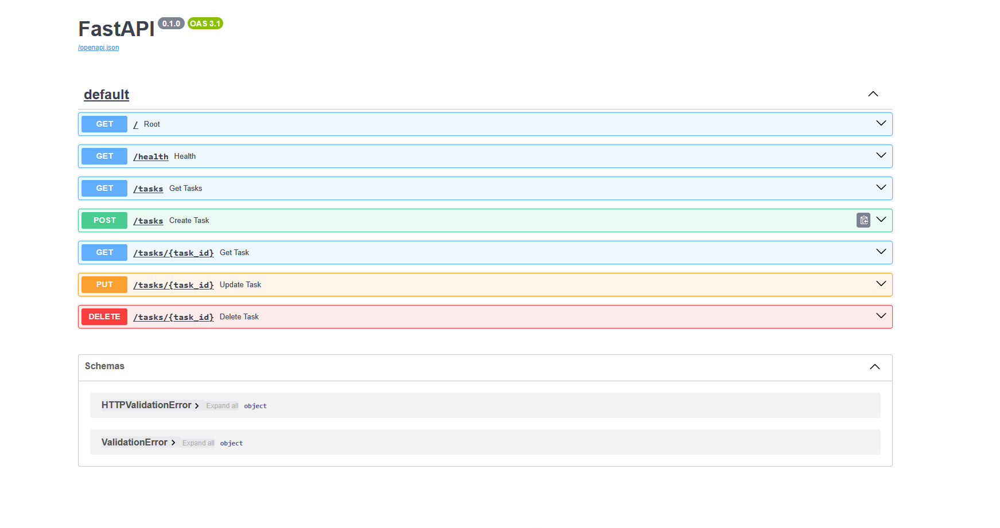

# Task API

A simple RESTful **Task Management API** built with [FastAPI](https://fastapi.tiangolo.com/). It provides CRUD (Create, Read, Update, Delete) operations over an in-memory list of tasks. Each task has an `id`, a `title`, and a `done` status.

This project is a lightweight starter/demo API — data is stored in memory (see `db.py`), so all tasks reset when the server restarts.

## Features

- List all tasks
- Retrieve a single task by ID
- Create new tasks
- Update existing tasks
- Delete tasks
- Health check endpoint
- Interactive API docs via Swagger UI

## Tech Stack

- **Python** >= 3.12
- **FastAPI** — web framework
- **Uvicorn** — ASGI server
- **uv** — dependency & environment management
- **SQLModel / SQLite** — ORM and database

## Database Configuration

The application uses **SQLite** as the database backend:

- **Why SQLite was chosen**: SQLite was chosen for its simplicity, zero-configuration nature, and perfect fit for this single-file application. It's an in-process embedded database that's ideal for development and small-scale production.

- **Database file location**: The SQLite database file `tasks.db` is stored in the project root directory (`D:\work\projects\flyrank\Assignment 2\`).

- **Database schema**: The schema is auto-created using SQLAlchemy/SQLModel metadata and populated with sample data on first run. The database persists between application restarts.

### Database Access

The database is accessed through:
- `db/engine.py` — Database engine configuration
- `db/models.py` — Task model definition
- `db/operations.py` — Query operations

## Example SQL Query

Here's an example SQL query that was executed:

```sql
SELECT * FROM tasks;
```

This retrieves all tasks from the database and was used in the database initialization to populate sample data.

## Project Structure

```
Assignment 1/
├── main.py           # FastAPI app and all endpoint definitions
├── db.py             # In-memory task data store
├── pyproject.toml    # Project metadata and dependencies
├── uv.lock           # Locked dependency versions
├── README.md         # This file
└── swagger-ui.png    # Screenshot of the Swagger UI
```

## Setup & Installation

### Using uv (recommended)

```bash
# Install dependencies
uv sync

# Run the server
uv run main.py
```

### Using pip

```bash
# Create and activate a virtual environment
python -m venv .venv
.venv\Scripts\activate        # Windows
# source .venv/bin/activate   # macOS / Linux

# Install dependencies
pip install fastapi uvicorn sqlmodel

# Run the server
python main.py
```

The server starts on **http://0.0.0.0:8000**.

## API Documentation

Once running, interactive documentation is available at:

- **Swagger UI:** http://localhost:8000/docs
- **ReDoc:** http://localhost:8000/redoc



## Endpoints

Base URL: `http://localhost:8000`

| Method | Path               | Description                          |
| ------ | ------------------ | ------------------------------------ |
| GET    | `/`                | API metadata and available endpoints |
| GET    | `/health`          | Service health status                |
| GET    | `/tasks`           | List all tasks                       |
| GET    | `/tasks/{task_id}` | Get a single task by ID              |
| POST   | `/tasks`           | Create a new task                    |
| PUT    | `/tasks/{task_id}` | Update an existing task              |
| DELETE | `/tasks/{task_id}` | Delete a task                        |

### Task Object

```json
{
  "id": 1,
  "title": "Complete README",
  "done": false
}
```

---

### `GET /`

Returns basic API metadata.

**Request**

```bash
curl http://localhost:8000/
```

**Response** `200 OK`

```json
{
  "name": "Task API",
  "version": "1.0",
  "endpoints": ["/tasks"]
}
```

---

### `GET /health`

Health check to confirm the service is running.

**Request**

```bash
curl http://localhost:8000/health
```

**Response** `200 OK`

```json
{ "status": "ok" }
```

---

### `GET /tasks`

Returns a list of all tasks.

**Request**

```bash
curl http://localhost:8000/tasks
```

**Response** `200 OK`

```json
[
  { "id": 1, "title": "Complete README", "done": false },
  { "id": 2, "title": "Update Project Dependencies", "done": true },
  { "id": 3, "title": "Add Task", "done": false }
]
```

---

### `GET /tasks/{task_id}`

Returns a single task by its ID.

**Request**

```bash
curl http://localhost:8000/tasks/1
```

**Response** `200 OK`

```json
{ "id": 1, "title": "Complete README", "done": false }
```

**Response** `404 Not Found` — when the task does not exist.

---

### `POST /tasks`

Creates a new task. `title` is required.

**Request**

```bash
curl -X POST http://localhost:8000/tasks \
  -H "Content-Type: application/json" \
  -d '{ "title": "Write tests" }'
```

**Request Body**

| Field   | Type   | Required | Description       |
| ------- | ------ | -------- | ----------------- |
| `title` | string | Yes      | The task's title  |

**Response** `201 Created`

**Response** `400 Bad Request` — when `title` is missing:

```json
{ "error": "Title is required" }
```

---

### `PUT /tasks/{task_id}`

Updates an existing task's `title` and/or `done` status. At least one valid field must be provided.

**Request**

```bash
curl -X PUT http://localhost:8000/tasks/1 \
  -H "Content-Type: application/json" \
  -d '{ "title": "Complete README", "done": true }'
```

**Request Body**

| Field   | Type    | Required | Description                    |
| ------- | ------- | -------- | ------------------------------ |
| `title` | string  | No       | New title for the task         |
| `done`  | boolean | No       | New completion status          |

**Response** `200 OK` — returns the updated task.

**Response** `400 Bad Request` — when no valid fields are provided:

```json
{ "error": "No valid fields to update" }
```

**Response** `404 Not Found` — when the task does not exist.

---

### `DELETE /tasks/{task_id}`

Deletes a task by its ID.

**Request**

```bash
curl -X DELETE http://localhost:8000/tasks/1
```

**Response** `200 OK` — when deleted successfully.

**Response** `404 Not Found` — when the task does not exist.

---

## Notes

- Data is stored **in memory** (`db.py`). All changes are lost when the server restarts.
- The `next_id` counter auto-increments for newly created tasks.
